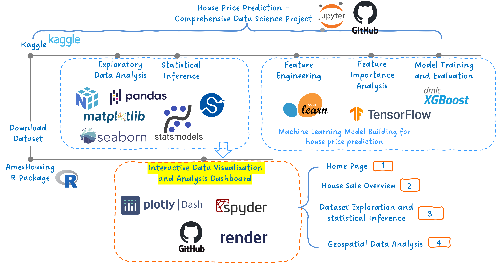

   
   
This GitHub repository is for the source code of a data analysis dashboard with Dash Plotly:   

**[House Sale Evaluation -- Interactive Data Visualization & Analysis with AmesHousing Dataset](https://ameshousing-interactive-eda-app.onrender.com)** (click to open the dashboard).  

This dashboard is an extension of data science project: **[House Price Prediction – Comprehensive Data Science Project](https://github.com/ZNL0504/House-Price-Prediction)**.   
The goal of this dashboard is to interactively visualize data, interpret analytical results, and extract data insights in a very flexible and intuitive approach.  

The main content of the dashboard is divided into three parts, each with one page.
- The first part is house sale overview, where trend and pattern over time is shown in terms of sale volumn, gross sale and mean sale price.
- The second part focuses on dataset exploration and statistical inference to provide evidence of most important house price predictors and reveal relationship among different variables.
- It ends with geospatial data analysis to show how locations can impact house sale price and relate to other features in the dataset.

In summary, the project provides a data story telling platform, and the dashboard help bring the story to life.  
The image below depicts the outline and workflow of the whole project, as well as the basic components of the dashboard structure.

## Dashboard Screenshots
   
   
   
   
   
